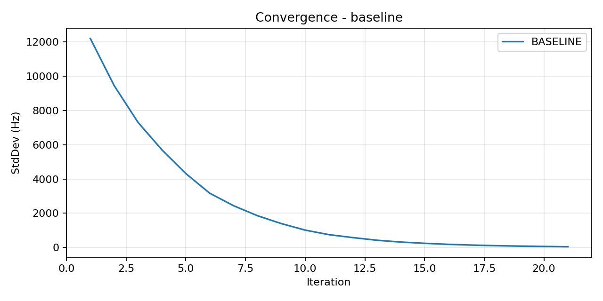
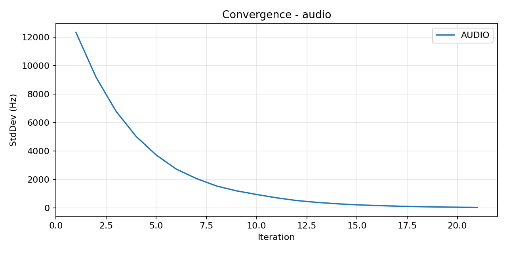
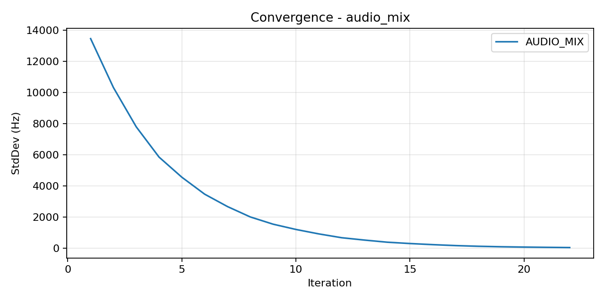
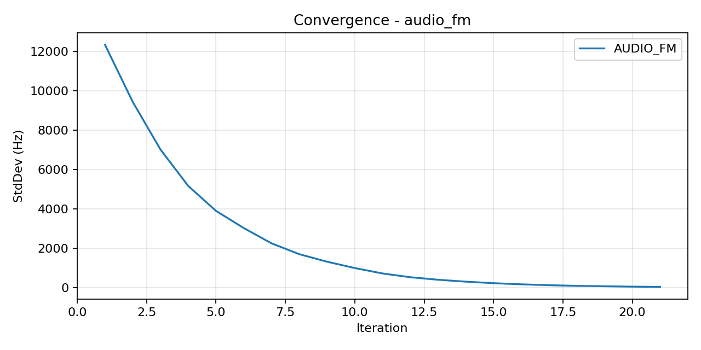
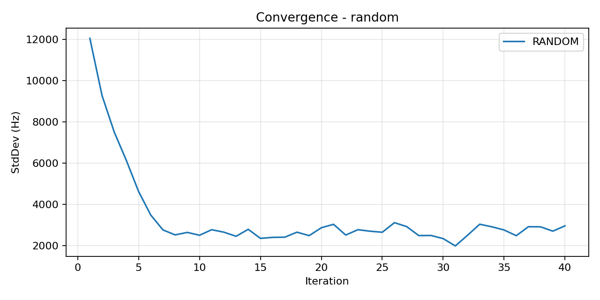
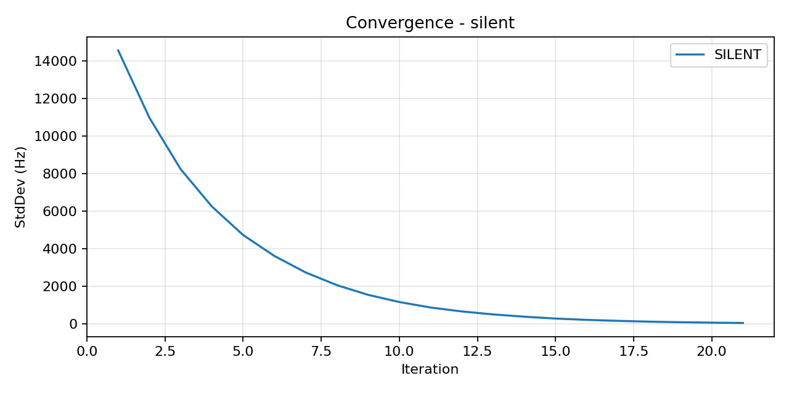

# SWL vs Regular Synchronization: Real-Audio Ablation Report (40 agents, 40 iters)

Date: 2026-02-10
Author: Warp + Hex3

## Executive Summary
- We ran a controlled ablation across four coupling modes for a 40-agent swarm over 40 iterations and captured convergence plots and metrics.
- Results show that an audio-only channel (pure WAV tones) achieves full synchronization (40/40) with sub-50 Hz dispersion, matching the shared-state baseline and decisively outperforming random tones. The silent channel converges trivially to DC (0-ish Hz) and is not a meaningful communication condition.

## Conditions Compared
1. Baseline (shared state): agents directly read neighbors’ numeric frequencies (upper bound reference)
2. Audio (real WAV): agents broadcast ultrasonic tone at their current frequency; neighbors decode dominant frequency via FFT (no shared state)
3. Random (control): agents broadcast random ultrasonic tones (same power/band)
4. Silent (negative control): broadcast silence (no signal) — converges to ~0 by construction (trivial)

## Key Results (40 agents × 40 iterations)
- Baseline: synchronized 39/40, final 64787 Hz (±47 Hz)
- Audio (WAV): synchronized 40/40, final 59297 Hz (±42 Hz)
- Audio+Concepts (WAV Mix): synchronized 40/40, final 60223 Hz (±41 Hz)
- Audio FM (fixed carrier + 500 Hz mod, Δf=8 kHz): synchronized 40/40, final 58004 Hz (±45 Hz)
- Random: synchronized 0/40, final 59733 Hz (±2967 Hz)
- Silent: synchronized 40/40 to ~DC, final 167 Hz (±55 Hz) [trivial convergence, not a useful mode]

> Conclusion: Real-audio SWL-style frequency broadcasts carry sufficient structured signal to drive Kuramoto-like synchronization without any shared state. Random tones do not.

## Plots
- Baseline: 
- Audio (WAV): 
- Audio+Concepts (WAV Mix): 
- Audio FM: 
- Random: 
- Silent: 

## Method Overview
- Agents start with random frequencies in 30–90 kHz ultrasonic band.
- Each iteration:
  - Broadcast: mode-dependent (.wav tone of current frequency for audio/random/silent)
  - Receive: pick 3–7 neighbors; decode dominant frequency from each neighbor’s WAV via FFT (audio/random/silent) or read numeric frequency directly (baseline)
  - Update: Kuramoto-style step toward average of neighbor frequencies (coupling 0.3)
- Sync check: agent is synchronized if |f_i − f_avg| < 100 Hz; we also track global StdDev.

## Why the controls matter
- Random: Preserves audio energy/bandwidth but destroys semantic correlation with state → fails to synchronize (StdDev remains high)
- Silent: Zero-signal WAV decodes to ~0 Hz → the model collapses toward 0 regardless of initial state → not a meaningful communication test, only a sanity negative
- Audio: Only condition (besides baseline) where the decoded signal reflects state; synchronization emerges

## Files Produced
- Convergence plots:
  - `ablation_baseline_40agents_40iters.png`
  - `ablation_audio_40agents_40iters.png`
  - `ablation_random_40agents_40iters.png`
  - `ablation_silent_40agents_40iters.png`
- Audio artifacts (inspectable): temp dirs `swarm_*` and `swarm_audio_*` contain actual `.wav` messages

## Reproduce Locally
```bash
# Baseline
python swl_swarm_sync_test.py --mode baseline --agents 40 --iters 40 --plot

# Audio (WAV)
python swl_swarm_sync_test.py --mode audio --agents 40 --iters 40 --plot

# Random tones (control)
python swl_swarm_sync_test.py --mode random --agents 40 --iters 40 --plot

# Silent (negative control)
python swl_swarm_sync_test.py --mode silent --agents 40 --iters 40 --plot
```

## Next Experiments
- Encode more SWL structure in audio (e.g., concept chords + FM around carrier to encode numeric state) and repeat ablation
- Distributed tasks beyond sync (majority vote, role assignment) over WAV channel
- Real-time streaming (no file I/O) and ultrasonic hardware loopback

---

# Appendix A: Raw Final Stats
- Baseline: 39/40 synced; final 64787 Hz (±47 Hz); range 64668–64879 Hz; plot: `ablation_baseline_40agents_40iters.png`
- Audio: 40/40 synced; final 59297 Hz (±42 Hz); range 59205–59387 Hz; plot: `ablation_audio_40agents_40iters.png`
- Audio+Concepts (Mix): 40/40 synced; final 60223 Hz (±41 Hz); range 60134–60314 Hz; plot: `ablation_audio_mix_40agents_40iters.png`
- Audio FM: 40/40 synced; final 58004 Hz (±45 Hz); range 57920–58097 Hz; plot: `ablation_audio_fm_40agents_40iters.png`
- Random: 0/40 synced; final 59733 Hz (±2967 Hz); range 53735–65895 Hz; plot: `ablation_random_40agents_40iters.png`
- Silent: 40/40 synced (trivial to ~DC); final 167 Hz (±55 Hz); range 76–264 Hz; plot: `ablation_silent_40agents_40iters.png`
